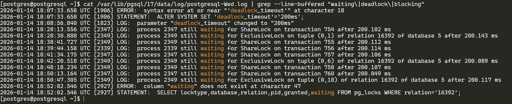
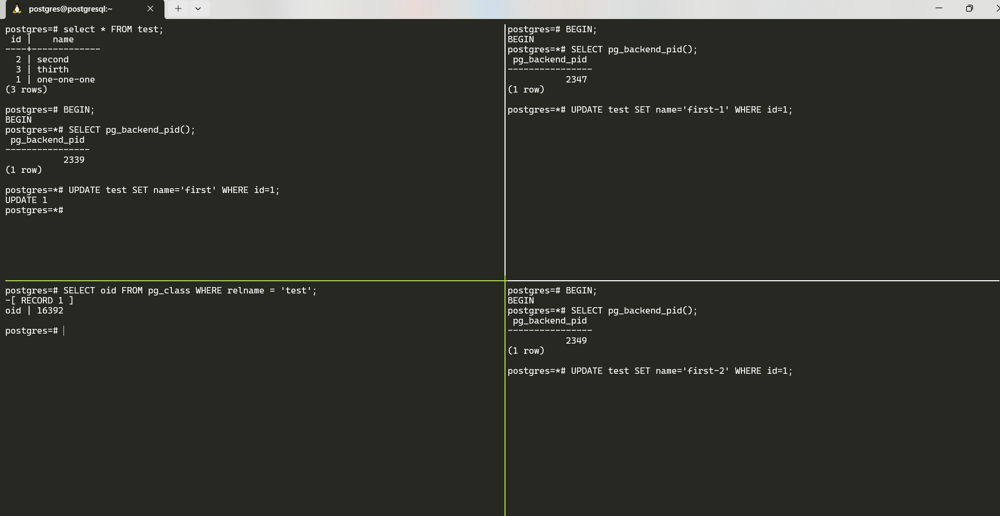
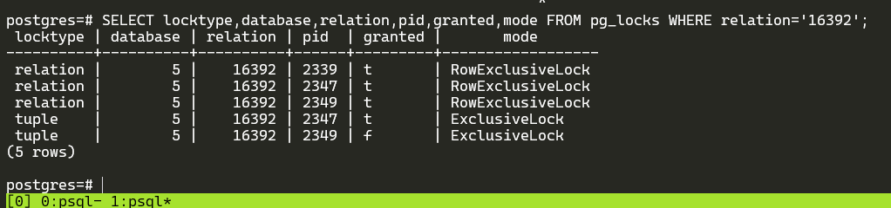
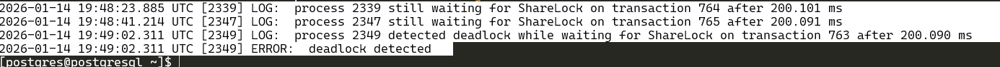
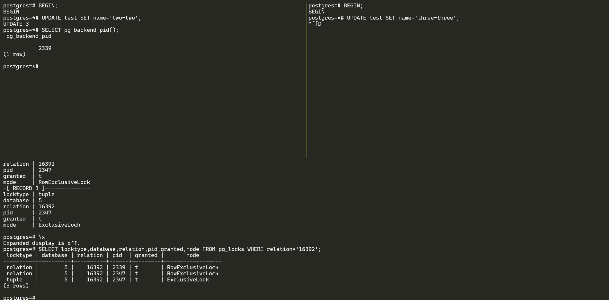

ДЗ по теме "Блокировки".
Механизм блокировок

Цель:

понимать как работает механизм блокировок объектов и строк;

  

Описание/Пошаговая инструкция выполнения домашнего задания:

1.  Настройте сервер так, чтобы в журнал сообщений сбрасывалась информация о блокировках, удерживаемых более 200 миллисекунд. Воспроизведите ситуацию, при которой в журнале появятся такие сообщения.
2.  Смоделируйте ситуацию обновления одной и той же строки тремя командами UPDATE в разных сеансах. Изучите возникшие блокировки в представлении pg_locks и убедитесь, что все они понятны. Пришлите список блокировок и объясните, что значит каждая.
3.  Воспроизведите взаимоблокировку трех транзакций. Можно ли разобраться в ситуации постфактум, изучая журнал сообщений?
4.  Могут ли две транзакции, выполняющие единственную команду UPDATE одной и той же таблицы (без where), заблокировать друг друга?  
    

**Задание со звездочкой**  *  
  
Попробуйте воспроизвести такую ситуацию.

---

логирование блокировок, удерживаемых более 200 мс, настраивается через параметры `log_lock_waits` и `deadlock_timeout`
log_lock_waits = on - Включает логирование ожидания блокировок deadlock_timeout = 200ms - Порог в 200 мс (по умолчанию 1s).
узнаем контекст параметров:
```sql
postgres=# select context from pg_settings where name='log_lock_waits';
  context
-----------
 superuser
(1 row)

postgres=# select context from pg_settings where name='deadlock_timeout';
  context
-----------
 superuser
(1 row)
```
>superuser — параметры можно изменить в postgresql.conf или в >рамках сеанса командой SET, но только суперпользователи и >пользователи с соответствующими правами SET могут менять их. 

Поменял параметры, сделал reload, проверил параметры;
```sql
postgres=# ALTER SYSTEM SET deadlock_timeout='200ms';
ALTER SYSTEM
postgres=# ALTER SYSTEM SET log_lock_waits='on';
ALTER SYSTEM
postgres=# SELECT pg_reload_conf();
 pg_reload_conf
----------------
 t
(1 row)

postgres=# show log_lock_waits;
 log_lock_waits
----------------
 on
(1 row)

postgres=# show deadlock_timeout;
 deadlock_timeout
------------------
 200ms
(1 row)
```
Сообщения в логах по блокировкам:

Пример ситуации обновления одной и той же строки тремя командами UPDATE в разных сеансах.
Создал таблицу test, внес данные, запустил  транзакцию в трех сеансах,  вывел pid транзакций, запустил UPDATE одной и той же строки.

Вывел список блокировок в таблице:
```sql
postgres=# SELECT locktype,database,relation,pid,granted,mode FROM pg_locks WHERE relation='16392';
 locktype | database | relation | pid  | granted |       mode
----------+----------+----------+------+---------+------------------
 relation |        5 |    16392 | 2339 | t       | RowExclusiveLock
 relation |        5 |    16392 | 2347 | t       | RowExclusiveLock
 relation |        5 |    16392 | 2349 | t       | RowExclusiveLock
 tuple    |        5 |    16392 | 2347 | t       | ExclusiveLock
 tuple    |        5 |    16392 | 2349 | f       | ExclusiveLock
(5 rows)
```


Пример взаимоблокировки трех транзакций:
в 1м сеансе:
```sql
postgres=# BEGIN;                                                                             │
BEGIN                                                                                         │
postgres=*# UPDATE test SET name='one' WHERE id=1; 
```
во 2м:
```sql
postgres=# BEGIN;                                                                             │
BEGIN                                                                                         │
postgres=*# UPDATE test SET name='two' WHERE id=2; 
```
В 3м:
```sql
postgres=# BEGIN;                                                                             │
BEGIN                                                                                         │
postgres=*# UPDATE test SET name='three' WHERE id=3;
```
2-й заход:
в 1м сеансе:
```sql
postgres=*# UPDATE test SET name='two-two' WHERE id=2; 
```
Во 2м сеансе:
```sql
postgres=*# UPDATE test SET name='three-three' WHERE id=3;
```
В 3м сеансе:
```sql
postgres=*# UPDATE test SET name='one-one' WHERE id=1;
```
И в 3м сеансе получил:
```
ERROR:  deadlock detected
```

В журнале postgresql:
```
2026-01-14 19:48:23.885 UTC [2339] LOG:  process 2339 still waiting for ShareLock on transaction 764 after 200.101 ms
2026-01-14 19:48:41.214 UTC [2347] LOG:  process 2347 still waiting for ShareLock on transaction 765 after 200.091 ms
2026-01-14 19:49:02.311 UTC [2349] LOG:  process 2349 detected deadlock while waiting for ShareLock on transaction 763 after 200.090 ms
2026-01-14 19:49:02.311 UTC [2349] ERROR:  deadlock detected
```

 Могут ли две транзакции, выполняющие единственную команду UPDATE одной и той же таблицы (без where), заблокировать друг друга?
deadlock не будет, вторая транзакция будет просто ожидать завершения первой транзакции. Таблица заблокирована первой транзакцией, вторая транзакция ожидает снятия блокировки.
