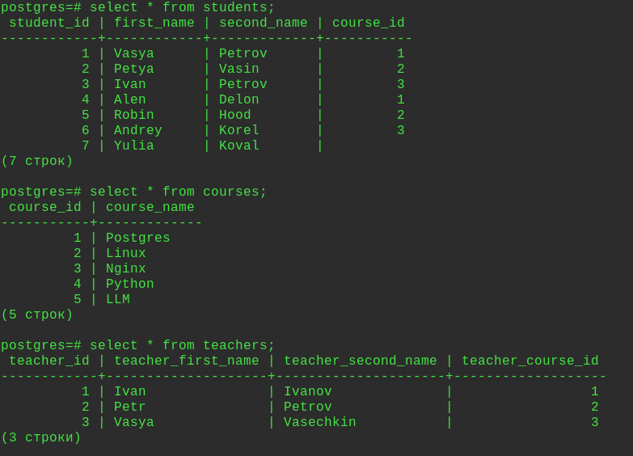
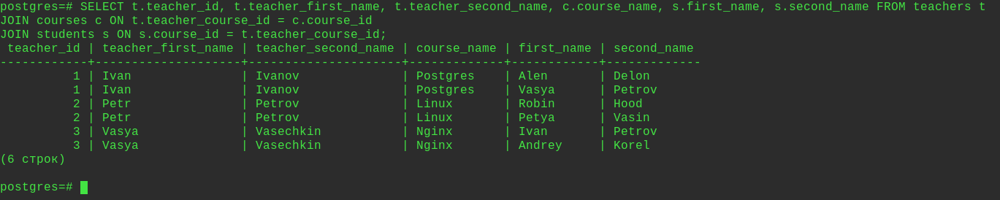
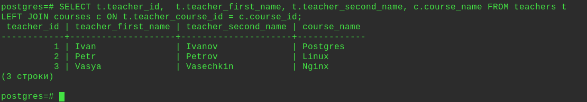
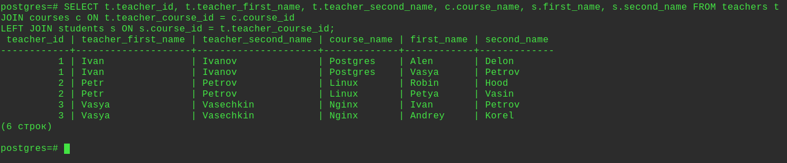

### Домашнее задание по теме: "Выборка данных, виды join'ов. Применение и оптимизация".

Домашнее задание
Работа с join

***Цель:***
знать и уметь применять различные виды join'ов;
строить и анализировать план выполенения запроса;
оптимизировать запрос;
уметь собирать и анализировать статистику для таблицы;


***Описание/Пошаговая инструкция выполнения домашнего задания:***
Необходимо:

Реализовать прямое соединение двух или более таблиц
Реализовать левостороннее (или правостороннее)
соединение двух или более таблиц
Реализовать кросс соединение двух или более таблиц
Реализовать полное соединение двух или более таблиц
Реализовать запрос, в котором будут использованы
разные типы соединений
Сделать комментарии на каждый запрос
К работе приложить структуру таблиц, для которых
выполнялись соединения.

---
Создал 3 таблицы:

1я таблица, создать, внести данные.
```sql
CREATE TABLE students(student_id serial, first_name varchar, second_name varchar, course_id int);
```
```sql
INSERT INTO students(student_id, first_name, second_name, course_id)
VALUES
(1,'Vasya','Petrov',1),
(2,'Petya','Vasin',2),
(3,'Ivan','Petrov',3),
(4,'Alen','Delon',1),
(5,'Robin','Hood',2),
(6,'Andrey','Korel',3),
(7,'Yulia','Koval',NULL);
```

2я таблица, создать, внести данные.
```sql
CREATE TABLE courses(course_id serial, course_name varchar);
```
```sql
INSERT INTO courses(course_id, course_name)
VALUES
(1,'Postgres'),
(2,'Linux'),
(3,'Nginx'),
(4,'Python'),
(5,'LLM');
```
3я таблица, создать, внести данные.
```sql
CREATE TABLE teachers(teacher_id serial, teacher_first_name varchar, teacher_second_name varchar, teacher_course_id int);
```
```sql
INSERT INTO teachers(teacher_id, teacher_first_name, teacher_second_name, teacher_course_id)
VALUES
(1,'Ivan','Ivanov',1),
(2,'Petr','Petrov',2),
(3,'Vasya','Vasechkin',3);
```
В итоге содержимое таблиц:


1. INNER JOIN.   Вывел список id преподавателей, их имена, названия их курсов  и студентов на курсах.
```sql
SELECT t.teacher_id, t.teacher_first_name, t.teacher_second_name, c.course_name, s.first_name, s.second_name FROM teachers t
JOIN courses c ON t.teacher_course_id = c.course_id
JOIN students s ON s.course_id = t.teacher_course_id;
```

2. LEFT JOIN.  Вывел список id преподавателей, их имена, названия их курсов.
```sql
SELECT t.teacher_id,  t.teacher_first_name, t.teacher_second_name, c.course_name FROM teachers t
LEFT JOIN courses c ON t.teacher_course_id = c.course_id;
```

3. CROSS JOIN. Вывел все варианты из таблиц teachers и courses.
```sql
SELECT * FROM students s
CROSS JOIN teachers t
CROSS JOIN courses c;
```
4. FULL JOIN. Все записи из таблиц students и teachers.
```sql
SELECT * FROM students s
FULL JOIN teachers t ON t.teacher_course_id = s.course_id;
```
5.  Запрос, в котором будут использованы разные типы соединений.
```sql
SELECT t.teacher_id, t.teacher_first_name, t.teacher_second_name, c.course_name, s.first_name, s.second_name FROM teachers t
JOIN courses c ON t.teacher_course_id = c.course_id
LEFT JOIN students s ON s.course_id = t.teacher_course_id;
```

