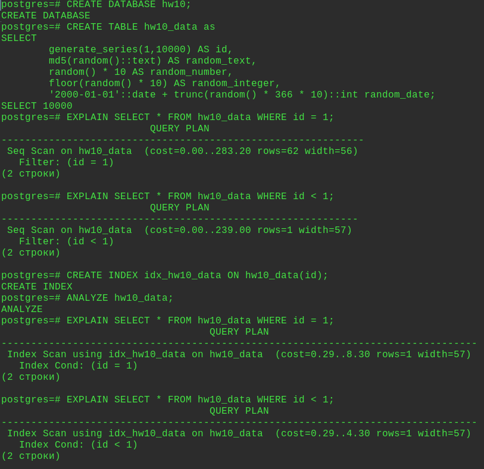
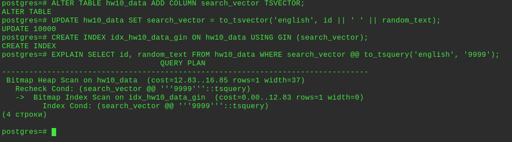
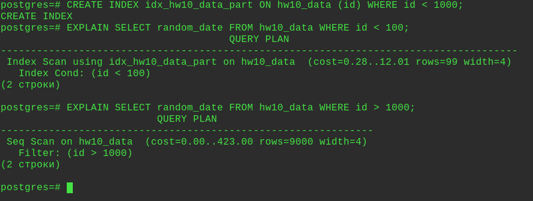
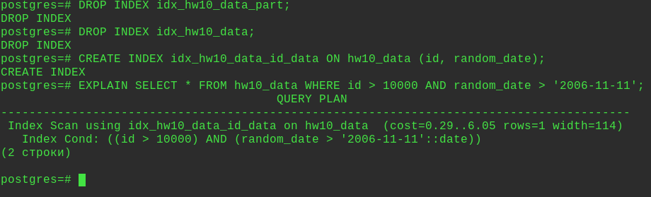

### ДЗ по теме: "Виды индексов. Работа с индексами и оптимизация запросов "

Домашнее задание
Работа с индексами

Цель:
знать и уметь применять основные виды индексов PostgreSQL;
строить и анализировать план выполнения запроса;
оптимизировать запросы для использования индексов;

Описание/Пошаговая инструкция выполнения домашнего задания:
Необходимо:

Создать индекс к какой-либо из таблиц вашей БД
Прислать текстом результат команды explain,
в которой используется данный индекс
Реализовать индекс для полнотекстового поиска
Реализовать индекс на часть таблицы или индекс
на поле с функцией
Создать индекс на несколько полей
Написать комментарии к каждому из индексов
Описать что и как делали, с какими проблемами столкнулись

---
Создать БД:
```sql
CREATE DATABASE hw10;
```
Заполнить случайными данными:
```sql
CREATE TABLE hw10_data as
SELECT
	generate_series(1,10000) AS id,
	md5(random()::text) AS random_text,
	random() * 10 AS random_number,
	floor(random() * 10) AS random_integer,
	'2000-01-01'::date + trunc(random() * 366 * 10)::int random_date;
```
Проверить:
```sql
SELECT * FROM hw10_data;
```
Посмотреть план запроса без индексов:
```sql
EXPLAIN SELECT * FROM hw10_data WHERE id = 1;

EXPLAIN SELECT * FROM hw10_data WHERE id < 1;
```

1. Создать индекс к hw10_data:
```sql
CREATE INDEX idx_hw10_data ON hw10_data(id);
```

2. Проверить использование индекса:
```sql
postgres=# ANALYZE hw10_data;

postgres=# EXPLAIN SELECT * FROM hw10_data WHERE id = 1;
                                   QUERY PLAN
--------------------------------------------------------------------------------
 Index Scan using idx_hw10_data on hw10_data  (cost=0.29..8.30 rows=1 width=57)
   Index Cond: (id = 1)
(2 строки)

postgres=# EXPLAIN SELECT * FROM hw10_data WHERE id < 1;
                                   QUERY PLAN
--------------------------------------------------------------------------------
 Index Scan using idx_hw10_data on hw10_data  (cost=0.29..4.30 rows=1 width=57)
   Index Cond: (id < 1)
(2 строки)
```


3. Реализовать индекс для полнотекстового поиска:

Добавить столбец с типом tsvector:
```sql
ALTER TABLE hw10_data ADD COLUMN search_vector TSVECTOR;
```
Заполнить столбец данными:
```sql
UPDATE hw10_data SET search_vector = to_tsvector('english', id || ' ' || random_text);
```
Создать индекс для полнотекстового поиска:
```sql
CREATE INDEX idx_hw10_data_gin ON hw10_data USING GIN (search_vector);
```
Посмотреть план запроса:
```sql
EXPLAIN SELECT id, random_text FROM hw10_data WHERE search_vector @@ to_tsquery('english', '9999');
```


4. Реализовать индекс на часть таблицы или индекс на поле с функцией.

Создать индекс:
```sql
CREATE INDEX idx_hw10_data_part ON hw10_data (id) WHERE id < 1000;
```
Посмотреть план запроса:
```sql
EXPLAIN SELECT random_date FROM hw10_data WHERE id < 100;
```
Посмотреть план запроса:
```sql
EXPLAIN SELECT random_date FROM hw10_data WHERE id > 1000;
```
При совпадении условия частичного индекса (WHERE id < 1000) он используется,
если условие не выполняется используется другой индекс.



5. Создать индекс на несколько полей.

Создать индекс по столбцам id, random_date:
```sql
CREATE INDEX idx_hw10_data_id_data ON hw10_data (id, random_date);
```
Посмотреть план запроса:
```sql
EXPLAIN SELECT * FROM hw10_data WHERE id > 10000 AND random_date > '2006-11-11';
```

