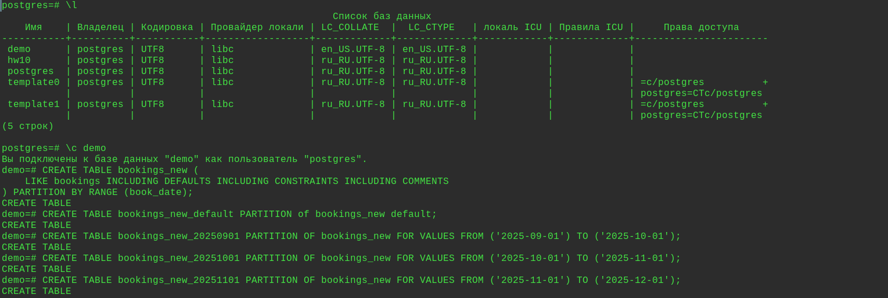
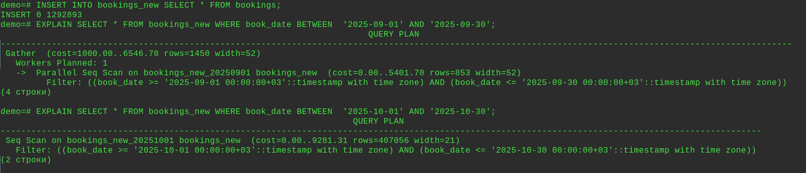
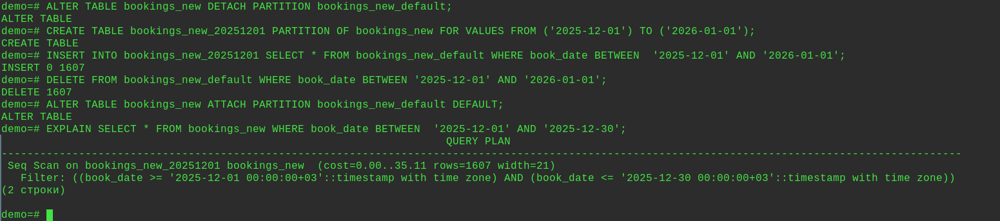
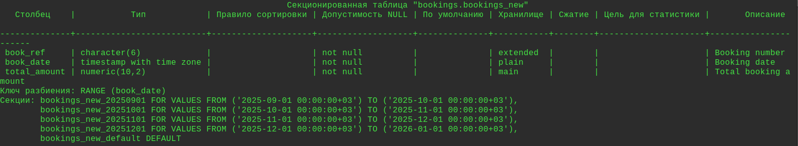
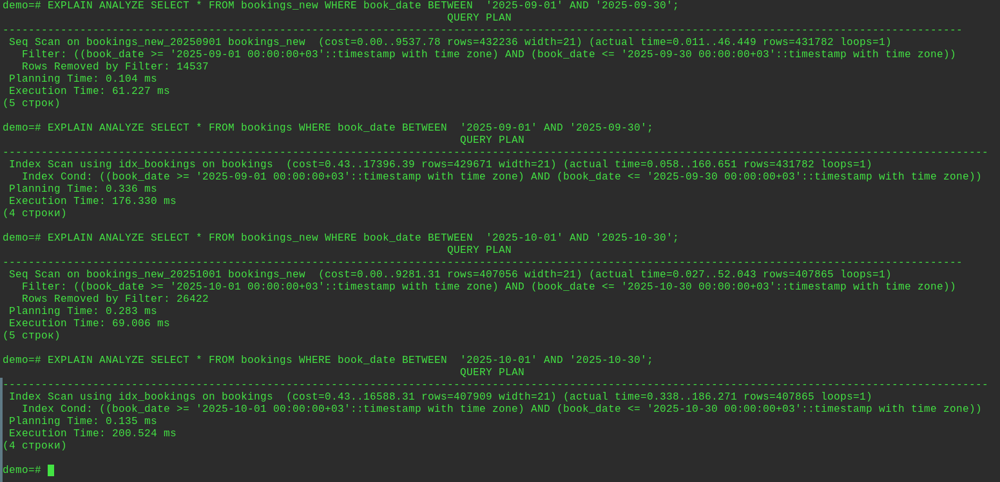
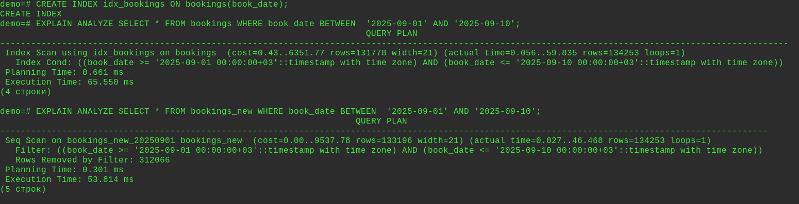
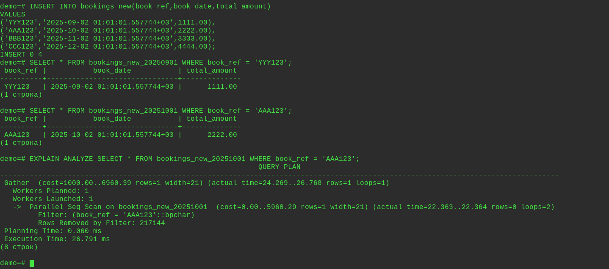

  
### Секционирование

#### Домашнее задание по теме "Секционирование таблицы".
Цель:
научиться выполнять секционирование таблиц в PostgreSQL;  
повысить производительность запросов и упростив управление данными;

#### Описание/Пошаговая инструкция выполнения домашнего задания:
На основе готовой базы данных примените один из методов секционирования в зависимости от структуры данных.  
[https://postgrespro.ru/education/demodb](https://postgrespro.ru/education/demodb "https://postgrespro.ru/education/demodb")  
  
**Шаги выполнения домашнего задания:**  
 
**Анализ структуры данных:**
-   Ознакомьтесь с таблицами базы данных, особенно с таблицами bookings, tickets, ticket_flights, flights, boarding_passes, seats, airports, aircrafts.
-   Определите, какие данные в таблице bookings или других таблицах имеют логическую привязку к диапазонам, по которым можно провести секционирование (например, дата бронирования, рейсы).
  
**Выбор таблицы для секционирования:**  
Основной акцент делается на секционировании таблицы bookings. Но вы можете выбрать и другие таблицы, если видите в этом смысл для оптимизации производительности (например, flights, boarding_passes).  
Обоснуйте свой выбор: почему именно эта таблица требует секционирования? Какой тип данных является ключевым для секционирования?  
  
**Определение типа секционирования:**  
Определитесь с типом секционирования, которое наилучшим образом подходит для ваших данных:
-   По диапазону (например, по дате бронирования или дате рейса).
-   По списку (например, по пунктам отправления или по номерам рейсов).
-   По хэшированию (для равномерного распределения данных).  

**Создание секционированной таблицы:**  
Преобразуйте таблицу в секционированную с выбранным типом секционирования.  
Например, если вы выбрали секционирование по диапазону дат бронирования, создайте секции по месяцам или годам.  

**Миграция данных:**
-   Перенесите существующие данные из исходной таблицы в секционированную структуру.
-   Убедитесь, что все данные правильно распределены по секциям.

**Оптимизация запросов:**
-   Проверьте, как секционирование влияет на производительность запросов. Выполните несколько выборок данных до и после секционирования для оценки времени выполнения.
-   Оптимизируйте запросы при необходимости (например, добавьте индексы на ключевые столбцы).

**Тестирование решения:**  
Протестируйте секционирование, выполняя несколько запросов к секционированной таблице.  
Проверьте, что операции вставки, обновления и удаления работают корректно.  

**Документирование:**
-   Добавьте комментарии к коду, поясняющие выбранный тип секционирования и шаги его реализации.
-   Опишите, как секционирование улучшает производительность запросов и как оно может быть полезно в реальных условиях.

---

Скачал демо-базу по 3 месяцам:
```bash
wget https://edu.postgrespro.ru/demo-20250901-3m.sql.gz
gunzip -c demo-20250901-3m.sql.gz | psql -U postgres
```
Секционировать буду таблицу bookings по дате (RANGE) - так логичнее в этой таблице,
объём данных в подтаблицах будет ~ одинаков.

Создал новую таблицу для партиционирования - полную копию booking.
```sql
\c demo
CREATE TABLE bookings_new (
    LIKE bookings INCLUDING DEFAULTS INCLUDING CONSTRAINTS INCLUDING COMMENTS
) PARTITION BY RANGE (book_date);
```
Создал партиции:
Сначала default partition, потом остальные:
```sql
CREATE TABLE bookings_new_default PARTITION of bookings_new default;
CREATE TABLE bookings_new_20250901 PARTITION OF bookings_new FOR VALUES FROM ('2025-09-01') TO ('2025-10-01');
CREATE TABLE bookings_new_20251001 PARTITION OF bookings_new FOR VALUES FROM ('2025-10-01') TO ('2025-11-01');
CREATE TABLE bookings_new_20251101 PARTITION OF bookings_new FOR VALUES FROM ('2025-11-01') TO ('2025-12-01');
```


Скопировал данные:
```sql
INSERT INTO bookings_new SELECT * FROM bookings;
```
Проверил:
```sql
EXPLAIN SELECT * FROM bookings_new WHERE book_date BETWEEN  '2025-09-01' AND '2025-09-30';
EXPLAIN SELECT * FROM bookings_new WHERE book_date BETWEEN  '2025-10-01' AND '2025-10-30';
```


Посмотрел, что в подтаблице bookings_new_default:
```sql
SELECT * FROM bookings_new_default;
```
- данные за декабрь, буду перемещать их в подтаблицу.
Отсоединил bookings_new_default:
```sql
ALTER TABLE bookings_new DETACH PARTITION bookings_new_default;
```
Создал новую таблицу(партицию) для данных за декабрь:
```sql
CREATE TABLE bookings_new_20251201 PARTITION OF bookings_new FOR VALUES FROM ('2025-12-01') TO ('2026-01-01');
```
Скопировал данные в bookings_new_20251201:
```sql
INSERT INTO bookings_new_20251201 SELECT * FROM bookings_new_default WHERE book_date BETWEEN  '2025-12-01' AND '2026-01-01';
```
Удалил эти данные из bookings_new_default:
```sql
DELETE FROM bookings_new_default WHERE book_date BETWEEN '2025-12-01' AND '2026-01-01';
```
Присоединил обратно bookings_new_default:
```sql
ALTER TABLE bookings_new ATTACH PARTITION bookings_new_default DEFAULT;
```
Проверил, что осталось в bookings_new_default:
```sql
SELECT * FROM bookings_new_default;
```
- пусто  
Проверил, в какой таблице данные за декабрь:
```sql
EXPLAIN SELECT * FROM bookings_new WHERE book_date BETWEEN  '2025-12-01' AND '2025-12-30';
```
- в bookings_new_20251201.


Просмотрел тек. иинфо по секционированной таблице:
```sql
\d+ bookings_new
```


Сравнил выполнение запросов в старой таблице и в секционированной:
```sql
EXPLAIN ANALYZE SELECT * FROM bookings_new WHERE book_date BETWEEN  '2025-09-01' AND '2025-09-30';
EXPLAIN ANALYZE SELECT * FROM bookings WHERE book_date BETWEEN  '2025-09-01' AND '2025-09-30';
EXPLAIN ANALYZE SELECT * FROM bookings_new WHERE book_date BETWEEN  '2025-10-01' AND '2025-10-30';
EXPLAIN ANALYZE SELECT * FROM bookings WHERE book_date BETWEEN  '2025-10-01' AND '2025-10-30';
```
Скорость выполнения запросов увеличилась после секционирования.

Создал индекс по полю book_date на не секционизированной таблице:
```sql
CREATE INDEX idx_bookings ON bookings(book_date);
```
Сравнил снова:
```sql
EXPLAIN ANALYZE SELECT * FROM bookings WHERE book_date BETWEEN  '2025-09-01' AND '2025-09-10';
EXPLAIN ANALYZE SELECT * FROM bookings_new WHERE book_date BETWEEN  '2025-09-01' AND '2025-09-10';
```
В этих запросах скорость выполнения почти сравнялась.

Проверка вставки данных:
```sql
INSERT INTO bookings_new(book_ref,book_date,total_amount)
VALUES
('YYY123','2025-09-02 01:01:01.557744+03',1111.00),
('AAA123','2025-10-02 01:01:01.557744+03',2222.00),
('BBB123','2025-11-02 01:01:01.557744+03',3333.00),
('CCC123','2025-12-02 01:01:01.557744+03',4444.00);
```
Проверка:
```sql
SELECT * FROM bookings_new_20250901 WHERE book_ref = 'YYY123';
SELECT * FROM bookings_new_20251001 WHERE book_ref = 'AAA123';
```
все ок, данные вносятся в соответствующие подтаблицы.

