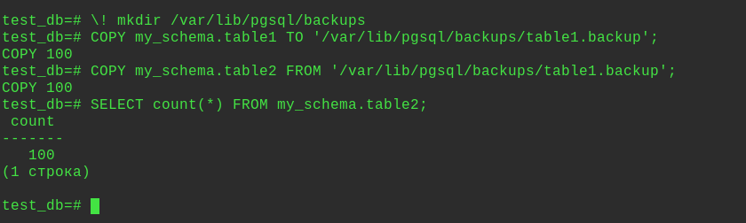
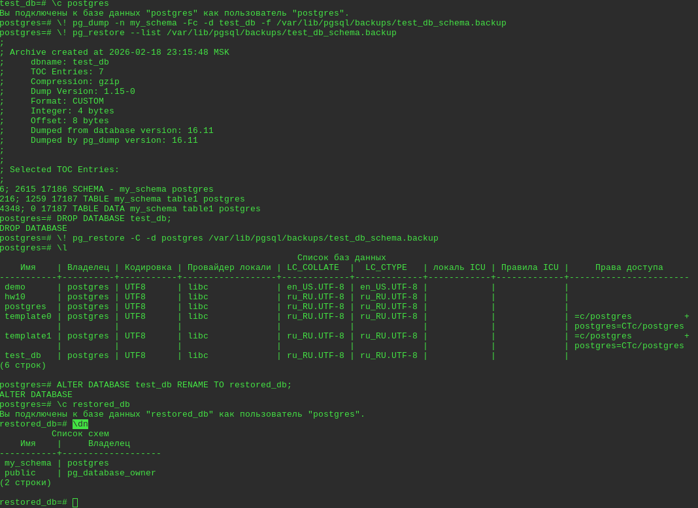
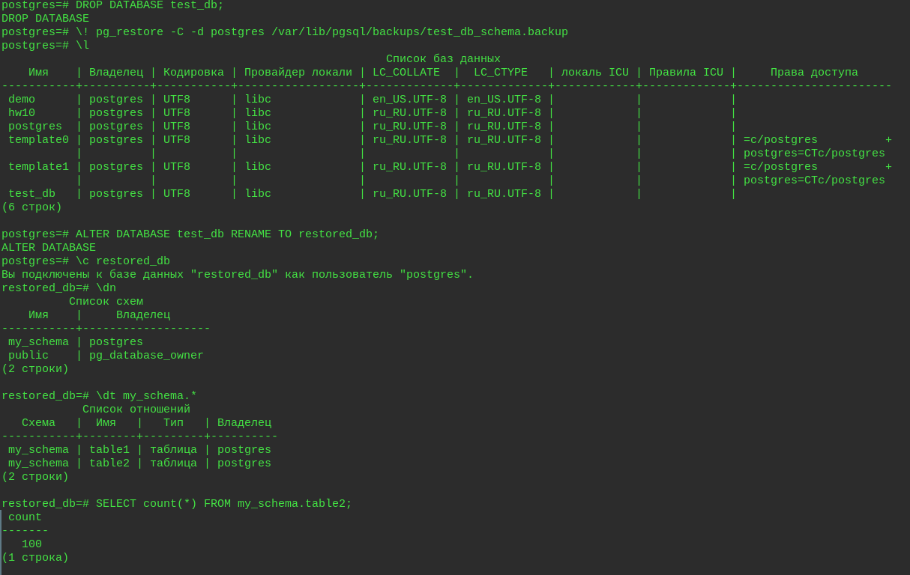

Домашнее задание по теме "Резервное копирование и восстановление "

Бэкапы

Цель:
применить логический бэкап;
восстановиться из бэкапа;

Описание/Пошаговая инструкция выполнения домашнего задания:  
1. Развернуть PostgreSQL (ВМ/Docker).  
2. В БД test_db создать схему my_schema и две одинаковые таблицы (table1, table2).  
3. Заполнить table1 100 строками с помощью generate_series.  
4. Создать каталог /var/lib/postgresql/backups/ под пользователем postgres.  
5. Бэкап через COPY: Выгрузить table1 в CSV командой \copy.  
6. Восстановление из COPY: Загрузить данные из CSV в table2.  
7. Бэкап через pg_dump: создать кастомный сжатый дамп (-Fc) только схемы my_schema.  
8. Восстановление через pg_restore: В новую БД restored_db восстановить только table2 из дампа.  

---
1. Развернул PostgreSQL на ВМ.
2. В БД test_db создать схему my_schema и две одинаковые таблицы (table1, table2).
Создал БД:
```sql
CREATE DATABASE test_db;
```
Подключился:
```sql
\c test_db
```
Создал схему
```sql
CREATE SCHEMA my_schema;
```
Проверил:
```sql
\dn
```
Создал таблицы:
```sql
CREATE TABLE my_schema.table1(id int);
```
```sql
CREATE TABLE my_schema.table2(id int);
```
3. Заполнить table1 100 строками с помощью generate_series.
```sql
INSERT INTO my_schema.table1 SELECT generate_series(1,100);
```
Проверил:
```sql
SELECT count(*) FROM my_schema.table1;
```


4. Создать каталог /var/lib/postgresql/backups/ под пользователем postgres.
```sql
\! mkdir /var/lib/pgsql/backups
```
5. Бэкап через COPY: Выгрузить table1 в CSV командой \copy.
```sql
COPY my_schema.table1 TO '/var/lib/pgsql/backups/table1.backup';
```
6. Восстановление из COPY: Загрузить данные из CSV в table2.
```sql
COPY my_schema.table2 FROM '/var/lib/pgsql/backups/table1.backup';
```
Проверка:
```sql
SELECT count(*) FROM my_schema.table2;
```


7. Бэкап через pg_dump: создать кастомный сжатый дамп (-Fc) только схемы my_schema.
```sql
\! pg_dump -n my_schema -Fc -d test_db -f /var/lib/pgsql/backups/test_db_schema.backup
```
Проверил:
```sql
\! pg_restore --list /var/lib/pgsql/backups/test_db_schema.backup
```

8. Восстановление через pg_restore: В новую БД restored_db восстановить только table2 из дампа.
```sql
DROP DATABASE test_db;
```
Поскольку бэкап создавался с флагом -n my_schema (только конкретная схема), в файле бэкапа нет команды создания самой схемы. 
Поэтому перед восстановлением таблицы нужно создать бд и схему вручную.
Создал базу:
```bash
psql -d postgres -c "CREATE DATABASE restored_db;"
```
Создал схему
```bash
\psql -d restored_db -c "CREATE SCHEMA my_schema;"
```
Восстановил таблицу в бд:
```bash
pg_restore -d restored_db --no-owner --no-privileges -t table2 /var/lib/pgsql/backups/test_db_schema.backup
```
Проверка:
```sql
\l
\c restored_db
```
```sql
\dn
```
```sql
SELECT count(*) FROM my_schema.table2;
```
```sql
SELECT count(*) FROM my_schema.table1;
```

