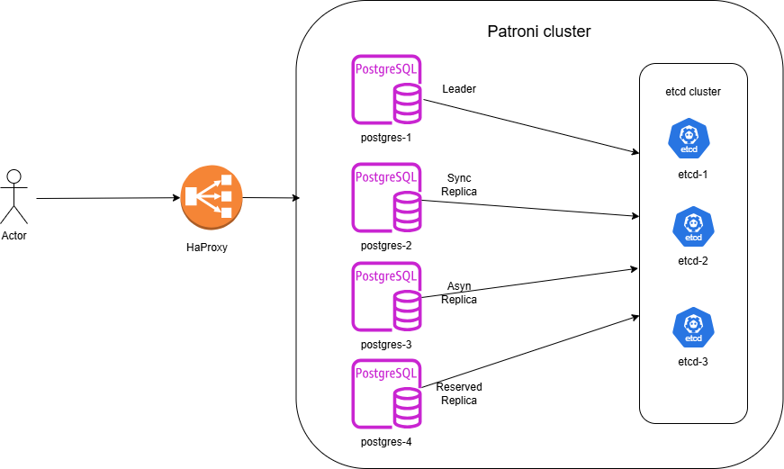

Проектная работа по теме: 
### "Создание и тестирование высоконагруженного отказоустойчивого кластера PostgreSQL на базе Patroni." 

1 этап - [Создание инфраструктуры на OpenStack.](infra/infra.md)  
2 этап - [Установка, настройка etcd  на сервера etcd-1,2,3.](etcd/etcd.md)  
3 этап - [1.Установка, настройка patroni  на сервера postgresql-1,2,3,4](patroni/patroni.md)  
4 этап - [Установка, настройка HaProxy](haproxy/haproxy.md)  

Схема:  
  
