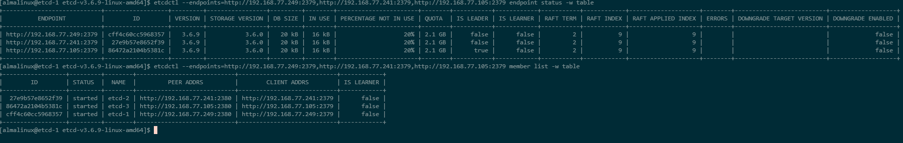

### Установка etcd кластера.  
отключил SELinux:
```
sudo setenforce 0
sudo sed -i "s/SELINUX=enforcing/SELINUX=permissive/" /etc/selinux/config
```
Создать пользователя и каталоги:
```
sudo useradd --system --home /var/lib/etcd --shell /sbin/nologin etcd || true
sudo mkdir -p /var/lib/etcd /etc/etcd
sudo chown -R etcd:etcd /var/lib/etcd /etc/etcd
```
скачал свежие бинарники etcd:
```
wget https://github.com/etcd-io/etcd/releases/download/v3.6.9/etcd-v3.6.9-linux-amd64.tar.gz
```
распаковал в /usr/local/bin:
```
sudo tar -xzvf ./etcd-v3.6.9-linux-amd64.tar.gz
```
бинарники etcd etcdctl etcdutl скопировал в /usr/local/bin

Создал env файл /etc/etcd/etcd.env :
```
ETCD_NAME=etcd-1
ETCD_DATA_DIR=/var/lib/etcd
ETCD_INITIAL_CLUSTER=etcd-1=http://192.168.77.249:2380,etcd-2=http://192.168.77.241:2380,etcd-3=http://192.168.77.105:2380
ETCD_INITIAL_CLUSTER_STATE=new
ETCD_INITIAL_CLUSTER_TOKEN=patroni-etcd-cluster
ETCD_INITIAL_ADVERTISE_PEER_URLS=http://192.168.77.249:2380
ETCD_LISTEN_PEER_URLS=http://192.168.77.249:2380
ETCD_LISTEN_CLIENT_URLS=http://192.168.77.249:2379
ETCD_ADVERTISE_CLIENT_URLS=http://192.168.77.249:2379
ETCD_ENABLE_V2=true
```
/- это для etcd-1, для etcd-2 etcd-3 такие же, только поменял ip.
Поставил права на файл:
```
sudo chown etcd:etcd /etc/etcd/etcd.env
```
Создал systemd unit:
sudo vi /etc/systemd/system/etcd.service
```
[Unit]
Description=etcd
After=network.target

[Service]
User=etcd
EnvironmentFile=/etc/etcd/etcd.env
ExecStart=/usr/local/bin/etcd
Restart=always
RestartSec=5
LimitNOFILE=40000

[Install]
WantedBy=multi-user.target
```
Перечитал изменения:
```
sudo systemctl daemon-reload
```
Запустил и включил сервис:
```
sudo systemctl enable --now etcd
```
Проверил:
```
sudo systemctl status etcd
```
Проверил статус кластера:
```
etcdctl --endpoints=http://192.168.77.249:2379,http://192.168.77.241:2379,http://192.168.77.105:2379 endpoint status -w table
etcdctl --endpoints=http://192.168.77.249:2379,http://192.168.77.241:2379,http://192.168.77.105:2379 member list -w table
```

Значения колонок вывода:
```
| ENDPOINT           | Адрес конкретного члена etcd, к которому подключился etcdctl.                  |
| ID                 | Уникальный ID узла в кластере etcd.                                            |
| VERSION            | Версия etcd, запущенная на этом узле.                                          |
| DB SIZE            | Размер базы данных etcd на этом узле.                                          |
| IS LEADER          | true, если этот узел сейчас лидер Raft-кластера.                               |
| IS LEARNER         | true, если узел в статусе learner, то есть ещё не полноценный голосующий член. |
| RAFT TERM          | Текущий term Raft — номер эпохи выборов лидера.                                |
| RAFT INDEX         | Последний индекс журнала Raft, известный узлу.                                 |
| RAFT APPLIED INDEX | Последний индекс журнала, который узел уже применил к состоянию.               |
| ERRORS             | Ошибки, если узел недоступен или статус не удалось получить. etcd+2            |

IS LEADER - узел является текущим лидером кластера.
Если RAFT INDEX и RAFT APPLIED INDEX у всех узлов одинаковые, это хорошо - репликация идёт синхронно и кластер здоров.
Что проверять:
IS LEADER: должен быть только один true в кластере.
IS LEARNER: для обычного стабильного кластера, false на всех узлах.
ERRORS: здесь не должно быть ошибок.
RAFT INDEX и RAFT APPLIED INDEX: большие расхождения могут указывать на отставание узла.
```
