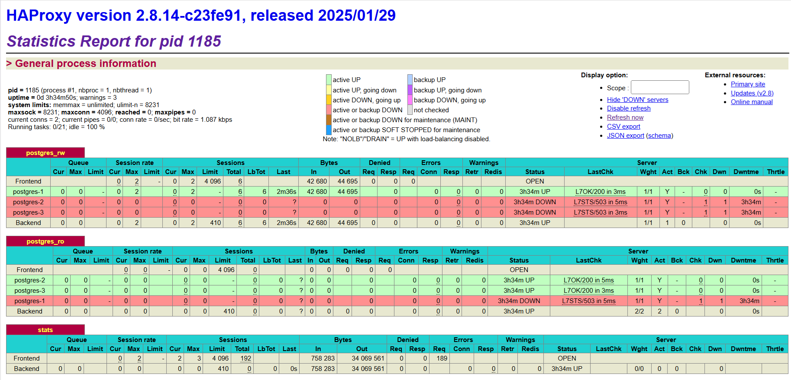
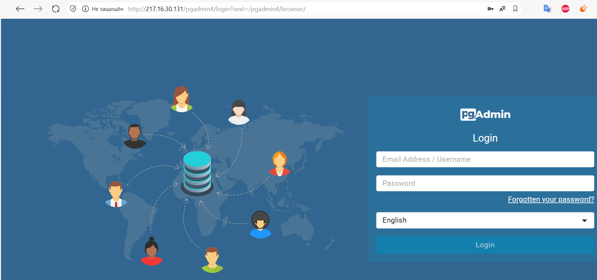

### Установка haproxy и PGAdmin4-web.
#### HaProxy:

#### Настройка вм с haproxy.  
Проверил обновления:
```
sudo dnf check-update
```
Обновил:
```
sudo dnf update
```
Установил haproxy:
```
sudo dnf install haproxy
```
Поставил firewalld:
```
sudo dnf install firewalld
sudo systemctl start firewalld
```
Сделал доступ по портам 22,80,443,5432,5433:
```
firewall-cmd --get-default-zone
firewall-cmd --zone=public --add-port=80/tcp
firewall-cmd --permanent --zone=public --add-port=80/tcp
firewall-cmd --zone=public --add-port=22/tcp
firewall-cmd --permanent --zone=public --add-port=22/tcp
firewall-cmd --zone=public --add-port=443/tcp
firewall-cmd --permanent --zone=public --add-port=443/tcp
firewall-cmd --zone=public --add-port=5432/tcp
firewall-cmd --permanent --zone=public --add-port=5432/tcp
firewall-cmd --zone=public --add-port=5433/tcp
firewall-cmd --permanent --zone=public --add-port=5433/tcp
``` 
Проверил статус SELinux: 
```
sestatus
```
Отключил SELinux: 
```
sudo setenforce 0
```
Отключил SELinux на постоянно: в  /etc/selinux/config  
```
SELINUX=enforcing поменял на SELINUX=disabled
```
Конфигурация haproxy:

```
global
    log /dev/log local0
    maxconn 4096

defaults
    log     global
    mode    tcp
    timeout connect 5s
    timeout client  30m
    timeout server  30m
    option  tcplog


# --- ТУТ НА ЗАПИСЬ ---
# Сюда подключаются приложения, которым нужно писать данные.
# Трафик пойдет ТОЛЬКО на мастер.
listen postgres_rw
    bind *:5432
    mode tcp
    balance leastconn #отправляет новые соединения на сервер с наименьшим количеством активных соединений (оптимально для мастера)
    option httpchk GET /primary   # Проверяем мастер-ноду через API Patroni.
    http-check expect status 200  # Мастер — тот, кто ответил 200 OK на этот эндпоинт
    default-server inter 3s fall 3 rise 2 on-marked-down shutdown-sessions
    #Как только сервер помечается как DOWN, HAProxy немедленно закрывает все активные сессии

    #проверка на 8008, а трафик идет на 6432
    # Все серверы в списке, но активен будет только тот, кто прошел check
    server postgres-1 192.168.77.104:5432 check port 8008
    server postgres-2 192.168.77.240:5432 check port 8008
    server postgres-3 192.168.77.129:5432 check port 8008

# --- ТУТ НА ЧТЕНИЕ ---
# Сюда подключаются задачи, которые только читают данные (отчеты, аналитика).
# Трафик распределяется между репликами.

listen postgres_ro
    bind *:5433
    mode tcp
    balance roundrobin          ## Для чтения подойдет roundrobin
    option httpchk GET /replica  # Проверяем реплику через API Patroni.
    http-check expect status 200 ## Реплика — тот, кто ответил 200 OK на этот эндпоинт
    default-server inter 3s fall 3 rise 2 on-marked-down shutdown-sessions
    #Как только сервер помечается как DOWN, HAProxy немедленно закрывает все активные сессии

    # Все серверы в списке, но активны будет только прошедшие check - реплики.
    # Реплики (получают весь трафик на чтение)
    server postgres-2 192.168.77.240:5432 check port 8008
    server postgres-3 192.168.77.129:5432 check port 8008

    # Мастер - только как резервный (если все реплики упали)
    server postgres-1 192.168.77.104:5432 check port 8008

# Статус для мониторинга
listen stats
    bind *:*****
    mode http
    stats enable
    stats uri /*****
    stats refresh 10s
    stats auth admin: *******
  ```

Проверка конфига:
```
haproxy -c -f /etc/haproxy/haproxy.cfg
```
включил и запустил haproxy:
```
systemctl enable --now haproxy
```


#### pgAdmin-web:

Pgadmin будет коннектиться на порт 5432, 5433 - где слушает haproxy.

Добавил репозиторий:
```
sudo rpm -i https://ftp.postgresql.org/pub/pgadmin/pgadmin4/yum/pgadmin4-redhat-repo-2-1.noarch.rpm
```
Установил пакет:
```
sudo yum install pgadmin4-web
```
скрипт конфигурации:
```
sudo /usr/pgadmin4/bin/setup-web.sh
```
После завершения заходим на http://server-ip/pgadmin4
Добавление пользователей через UI или скрипт.

