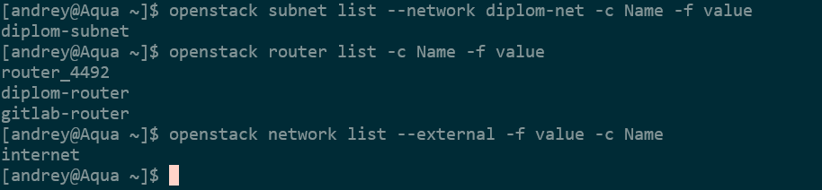
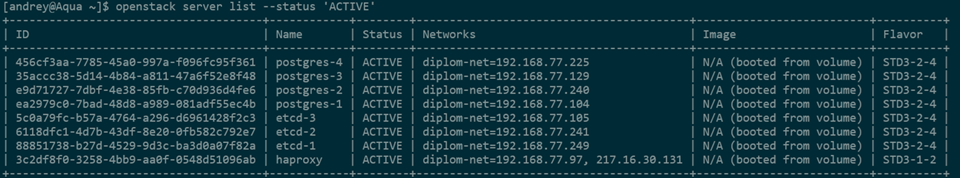

Создание инфраструктуры.  
Сети:  
1. Посмотреть существующие сети:
```
    openstack network list
```
2. Создать сеть:
```
 openstack network create diplom-net
```
3. Посмотреть список подсетей в сети:
```
    openstack subnet list --network diplom-net
```
4. Создать подсеть:
```
    openstack subnet create --network diplom-net --subnet-range 192.168.77.0/24 diplom-subnet
```
5. Просмотр текущих роутеров:
```
    openstack router list
```
6. Создать маршрутизатор:
```
    openstack router create diplom-router
```
7. Привязать подсеть к роутеру:
```
    openstack router add subnet diplom-router diplom-subnet
```
8. Список внешних сетей
```
    openstack network list --external -f value -c Name
```
9. Привязать внешнюю сеть к новому роутеру
```
    openstack router set --external-gateway internet diplom-router
```


#### Создание виртуалок.  
доступные шаблоны конфигурации вм: 
```
openstack flavor list
```
подробное инфо про выбранный шаблон: 
```
openstack flavor show тут-имя-шаблона
```
доступные образы ОС: 
```
openstack image list
```
подробнее про выбранный образ(я выбрал образ с almalinux 9.7): 
```
openstack image show тут-имя-образа
```
группы безопасности: 
```
openstack security group list
```
сделал security group:
```
openstack security group create haproxy
```
добавил правила в security group:
```
openstack security group rule create \
    --protocol tcp --dst-port 22 \
    --remote-ip 0.0.0.0/0 \
    haproxy

openstack security group rule create \
    --protocol tcp --dst-port 80 \
    --remote-ip 0.0.0.0/0 \
    haproxy

openstack security group rule create \
    --protocol tcp --dst-port 443 \
    --remote-ip 0.0.0.0/0 \
    haproxy
```
позднее к security group для haproxy добавлял правила по портам 5432 5433  

Посмотрел список сетей: 
```
openstack network list
```
Доступные ключевые пары: 
```
openstack keypair list
```
Создал диск для вм с haproxy:
```
openstack volume create haproxy \
--size 20 \
--image almalinux-9.7-202602051629.gite7a38aaf \
--availability-zone MS1 \
--bootable
```
Создал сервер с haproxy:
```
openstack server create haproxy \
--volume haproxy \
--network diplom-net \
--flavor STD3-1-2 \
--key-name pg1-vWKyphUl \
--security-group haproxy \
--availability-zone MS1
```
HaProxy нужен будет внешний адрес.  
Просмотрел доступные внешние адреса: 
```
openstack floating ip list
```
Получил новый "внешний" адрес: 
```
openstack floating ip create internet
```
Просмотрел полученный адрес: 
```
openstack floating ip list
```
"Привязал" полученный адрес к вм haproxy: 
```
openstack server add floating ip haproxy 217.16.30.131
```
Проверил, что адрес привязан к вм: 
```
openstack server show haproxy |grep addresses
```
ВМ с балансировщиком haproxy готова.

#### Настройка вм с haproxy.  
Проверил обновления:
```
sudo dnf check-update
```
Обновил:
```
sudo dnf update
```
Установил haproxy:
```
sudo dnf install haproxy
```
Поставил firewalld:
```
sudo dnf install firewalld
sudo systemctl start firewalld
```
Сделал доступ по портам 22,80,443:
```
firewall-cmd --get-default-zone
firewall-cmd --zone=public --add-port=80/tcp
firewall-cmd --permanent --zone=public --add-port=80/tcp
firewall-cmd --zone=public --add-port=22/tcp
firewall-cmd --permanent --zone=public --add-port=22/tcp
firewall-cmd --zone=public --add-port=443/tcp
firewall-cmd --permanent --zone=public --add-port=443/tcp
```
Позднее добавлял правила для портов 5432 5433.  
Проверил статус SELinux: 
```
sestatus
```
Отключил SELinux: 
```
sudo setenforce 0
```
Отключил SELinux на постоянно: в  /etc/selinux/config  
```
SELINUX=enforcing поменял на SELINUX=disabled
```
Конфигурация haproxy:

```
global
    log /dev/log local0
    maxconn 4096

defaults
    log     global
    mode    tcp
    timeout connect 5s
    timeout client  30m
    timeout server  30m
    option  tcplog


# --- ТУТ НА ЗАПИСЬ ---
# Сюда подключаются приложения, которым нужно писать данные.
# Трафик пойдет ТОЛЬКО на мастер.
listen postgres_rw
    bind *:5432
    mode tcp
    balance leastconn #отправляет новые соединения на сервер с наименьшим количеством активных соединений (оптимально для мастера)
    option httpchk GET /primary   # Проверяем мастер-ноду через API Patroni.
    http-check expect status 200  # Мастер — тот, кто ответил 200 OK на этот эндпоинт
    default-server inter 3s fall 3 rise 2 on-marked-down shutdown-sessions
    #Как только сервер помечается как DOWN, HAProxy немедленно закрывает все активные сессии

    #проверка на 8008, а трафик идет на 6432
    # Все серверы в списке, но активен будет только тот, кто прошел check
    server postgres-1 192.168.77.104:5432 check port 8008
    server postgres-2 192.168.77.240:5432 check port 8008
    server postgres-3 192.168.77.129:5432 check port 8008

# --- ТУТ НА ЧТЕНИЕ ---
# Сюда подключаются задачи, которые только читают данные (отчеты, аналитика).
# Трафик распределяется между репликами.

listen postgres_ro
    bind *:5433
    mode tcp
    balance roundrobin          ## Для чтения подойдет roundrobin
    option httpchk GET /replica  # Проверяем реплику через API Patroni.
    http-check expect status 200 ## Реплика — тот, кто ответил 200 OK на этот эндпоинт
    default-server inter 3s fall 3 rise 2 on-marked-down shutdown-sessions
    #Как только сервер помечается как DOWN, HAProxy немедленно закрывает все активные сессии

    # Все серверы в списке, но активны будет только прошедшие check - реплики.
    # Реплики (получают весь трафик на чтение)
    server postgres-2 192.168.77.240:5432 check port 8008
    server postgres-3 192.168.77.129:5432 check port 8008

    # Мастер - только как резервный (если все реплики упали)
    server postgres-1 192.168.77.104:5432 check port 8008

# Статус для мониторинга
listen stats
    bind *:*****
    mode http
    stats enable
    stats uri /*****
    stats refresh 10s
    stats auth admin: *******
  ```


### Подготовка хостов для etcd

сделал security group:
```
openstack security group create etcd
```
добавил правила в security group:
```
openstack security group rule create \
    --protocol tcp --dst-port 22 \
    --remote-ip 0.0.0.0/0 \
    etcd

openstack security group rule create \
    --protocol tcp --dst-port 2379 \
    --remote-ip 0.0.0.0/0 \
    etcd

openstack security group rule create \
    --protocol tcp --dst-port 2380 \
    --remote-ip 0.0.0.0/0 \
    etcd
```
Создал диски:
```
for i in {1,2,3};
do
openstack volume create etcd-$i \
--size 70 \
--image almalinux-9.7-202602051629.gite7a38aaf \
--availability-zone MS1 \
--bootable;
done
```
Создал серверы:
```
for i in {1,2,3}; do
openstack server create etcd-$i \
--volume etcd-$i \
--network diplom-net \
--flavor STD3-2-4 \
--key-name pg1-vWKyphUl \
--security-group etcd \
--availability-zone MS1;
done
```
Серверы для etcd созданы.

#### Сервера для Postgresql серверов.

сделал security group:
```
openstack security group create postgres
```
добавил правила в security group:
```
openstack security group rule create \
    --protocol tcp --dst-port 22 \
    --remote-ip 0.0.0.0/0 \
    postgres

openstack security group rule create \
    --protocol tcp --dst-port 5432 \
    --remote-ip 0.0.0.0/0 \
    postgres

openstack security group rule create \
    --protocol tcp --dst-port 8008 \
    --remote-ip 0.0.0.0/0 \
    postgres

openstack security group rule create \
    --protocol tcp --dst-port 6432 \
    --remote-ip 0.0.0.0/0 \
    postgres
```
Создал диски для Postgresql серверов:
```
for i in {1,2,3,4};
do
openstack volume create postgres-$i \
--size 50 \
--image almalinux-9.7-202602051629.gite7a38aaf \
--availability-zone MS1 \
--bootable;
done
```
Создал серверы Postgresql:
```
for i in {1,2,3,4}; do
openstack server create postgres-$i \
--volume postgres-$i \
--network diplom-net \
--flavor STD3-2-4 \
--key-name pg1-vWKyphUl \
--security-group etcd \
--availability-zone MS1;
done
```
Сервера для Postgresql созданы.


