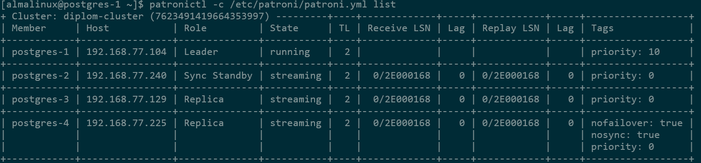

### Установка Postgresql на сервера СУБД.  
4 сервера: postgres-1,postgres-2,postgres-3,postgres-4.  
Конфигурация серверов: 2CPU, 4Gb RAM, 50Gb Hdd  

отключил SELinux:
```
sudo setenforce 0
sudo sed -i "s/SELINUX=enforcing/SELINUX=permissive/" /etc/selinux/config
```
Устанавливил postgresql-17, без инициализации! и без старта СУБД!(все сделает patroni):
Установка репозитория:
```
sudo dnf install -y https://download.postgresql.org/pub/repos/yum/reporpms/EL-9-x86_64/pgdg-redhat-repo-latest.noarch.rpm
```
Установка Postgresql:
```
sudo dnf install -y postgresql17-server
```
Установил нужные для Patroni зависимости:
```
sudo dnf install -y python3-pip
sudo dnf config-manager --set-enabled crb
sudo dnf install -y perl-IPC-Run python3-devel gcc make libpq-devel postgresql17-devel
sudo pip3 install psycopg2-binary
```
Установка Patroni с поддержкой etcd3
```
sudo pip3 install patroni[etcd3]
```
Проверил:
```
/usr/local/bin/patroni --version
/usr/local/bin/patronictl version
```
Создал пользователя patroni:
```
sudo useradd -r -s /bin/bash patroni
```
Создал директории patroni:
```
sudo mkdir -p /etc/patroni
sudo mkdir -p /var/lib/patroni
sudo mkdir -p /var/log/patroni
```
и права на них:
```
sudo chown -R patroni:patroni /etc/patroni /var/lib/patroni /var/log/patroni
```
Создал /var/lib/patroni/pgpass:
```
sudo tee /var/lib/patroni/pgpass > /dev/null <<EOF
*:*:*:postgres:postgres_secret_password
*:*:*:replicator:replicator_secret_password
EOF
```

и права на него:
```
sudo chown patroni:patroni /var/lib/patroni/pgpass
sudo chmod 600 /var/lib/patroni/pgpass
```
Про файл pgpass:
Файл pgpass в Patroni нужен для безпарольного подключения между узлами кластера 
при выполнении операций репликации, rewind, failover и мониторинга. Patroni 
автоматически создаёт и управляет этим файлом, записывая в него пароли для 
пользователей replication (реплика) и postgres (суперюзер).
Т.е. по идее этот файл вручную заполнять не надо. В нек. мануалах пишут 
про обязательность заполнения, в работе проверял - patroni перезаписывает 
этот файл после старта.

Т.к. бинарники PostgreSQL 17 на AlmaLinux 9.7 лежат в "нестандартном"  
(не таком как в ubuntu :-) ) пути (/usr/pgsql-17/bin),
их надо добавить в PATH пользователя patroni, чтобы он мог находить команды 
без указания полного пути:
```
sudo bash -c 'cat > /etc/profile.d/patroni-env.sh <<EOF
export PATH=/usr/local/bin:$PATH
EOF'
```

Применяем эти настройки (добавим /usr/local/bin в $PATH):
```
source /etc/profile.d/patroni-env.sh
```
Права на data_dir:
```
sudo chown -R patroni:patroni /var/lib/pgsql/
```
Сделал systemd unit для patroni:
```
[Unit]
Description=Patroni PostgreSQL High Availability Manager
Documentation=https://patroni.readthedocs.io/
After=network.target etcd.service
Wants=network.target

[Service]
Type=notify
User=patroni
Group=patroni

# Путь к конфигурационному файлу
EnvironmentFile=-/etc/patroni/patroni.env
ExecStart=/usr/local/bin/patroni /etc/patroni/patroni.yml

# Перезапуск при сбоях
Restart=always
RestartSec=5s

# Таймауты start/stop
TimeoutStartSec=300
TimeoutStopSec=300

# Лимиты ресурсов кол-во открытых файлов и процессов
LimitNOFILE=65536
LimitNPROC=65536

# Разрешаем запись в нужные директории
ReadWritePaths=/var/lib/patroni /var/log/patroni /etc/patroni

# Уведомления systemd о статусе
NotifyAccess=all

[Install]
WantedBy=multi-user.target
```
Перечитал изменения в systemd:
```
sudo systemctl daemon-reload
```
создал файл /etc/patroni/patroni.yml:
```
sudo vi /etc/patroni.patroni.yml
```

```
#postgresql-1
#имя кластера
scope: diplom-cluster
#Путь в DCS, где хранятся ключи кластера.
namespace: /pgcluster/
#имя узла
name: postgres-1
#логирование
log:
  level: INFO
  dir: /var/log/patroni

restapi:
#адрес, порт patroni, тут по всем адресам
  listen: 0.0.0.0:8008
#Адрес, который узел сообщает другим участникам кластера.
  connect_address: 192.168.77.104:8008
#Логин/пароль для доступа к API Patroni. Не ставил, но надо знать про это.
#  authentication:
#    username: patroni
#    password: patroni_pass

#где хранится состояние кластера.
etcd3:
  hosts:
    - 192.168.77.249:2379
    - 192.168.77.241:2379
    - 192.168.77.105:2379
#Сертификаты не делал
#  protocol: https
#  cacert: /etc/etcd/ca.pem
#  cert: /etc/etcd/server.pem
#  key: /etc/etcd/server-key.pem

#Настройки первичной инициализации
bootstrap:
#Метод инициализации: initdb (создать новый)
  method: initdb
  initdb:
    - encoding: UTF8
    - data-checksums
#Правила доступа (аналог pg_hba.conf), которые будут применены при инициализации.
  pg_hba:
    - host replication replicator 127.0.0.1/32 scram-sha-256
    - host replication replicator 192.168.77.0/24 scram-sha-256
    - host all all 192.168.77.0/24 scram-sha-256
#Пользователи, которые будут созданы в БД при инициализации.
  users:
    postgres:
      password: postgres_secret_password
      options: [superuser]
    replicator:
      password: replicator_secret_password
      options: [replication]
#Параметры, которые Patroni запишет в DCS при создании кластера
  dcs:
    ttl: 30
    loop_wait: 10
    retry_timeout: 10
    maximum_lag_on_failover: 1048576
    synchronous_mode: true
    postgresql:
      parameters:
        wal_level: replica
        max_wal_senders: 5
        max_replication_slots: 5

# Настройки Postgresql
postgresql:
#адрес и порт postgresql
  listen: 0.0.0.0:5432
#Адрес для подключения клиентов и реплик.
  connect_address: 192.168.77.104:5432
#Путь к каталогу данных PostgreSQL ($PGDATA) и каталогу с бинарниками(смотрим по pg_config --bindir).
  data_dir: /var/lib/pgsql/17/data/
  bin_dir: /usr/pgsql-17/bin/
#путь к файлу паролей PostgreSQL (.pgpass), который Patroni использует для аутентификации при подключении к локальному экземпляру базы данных.
  pgpass: /var/lib/patroni/pgpass
  authentication:
    superuser:
      username: postgres
      password: postgres_secret_password
    replication:
      username: replicator
      password: replicator_secret_password
    rewind:
      username: postgres
      password: postgres_secret_password
  parameters:
    unix_socket_directories: /tmp
    shared_buffers: 2GB
  use_pg_rewind: true

tags:
  nofailover: false
```
[patroni.yml from postgres-1](configs/patroni-postgresql-1.yml)  
[patroni.yml from postgres-2](configs/patroni-postgresql-2.yml)  
[patroni.yml from postgres-3](configs/patroni-postgresql-3.yml)  
[patroni.yml from postgres-4](configs/patroni-postgresql-4.yml)  
конфиги для всех 4-х реплик похожи, меняются только ip адреса и теги,  
которыми можно явно указать роль ноды в кластере:  

Предпочтительный Мастер: nofailover: false, nosync: false  
Кандидат в Синхронные: nofailover: false, nosync: false  
Кандидат в Асинхронные: nofailover: false, nosync: false  
Reserved Replica: nofailover: true, nosync: true  
чтобы "закрепить" синхронную реплику — надо исключить лишние узлы прописав им теги nosync: true  

проверка конфига:
```
patroni --validate-config /etc/patroni/patroni.yml
```
Все готово, поочередно включаем patroni на нодах:
```
sudo systemctl enable --now patroni
```
Если неудачно, проверяем логи:
```
journalctl -u patroni --no-pager -n 100
```
Статус кластера
```
patronictl -c /etc/patroni/patroni.yml list
```


Пауза репликации
```
patronictl pause diplom-cluster
```
Возобновить
```
patronictl resume diplom-cluster
```
Перезапуск узла
```
patronictl restart diplom-cluster postgres-1
```
Изменить конфиг
```
patronictl edit-config diplom-cluster
```
Перезапустить узел
```
patronictl restart diplom-cluster postgres-1
```
Остановить узел
```
patronictl stop diplom-cluster postgres-1
```
Переключить мастера
```
patronictl failover diplom-cluster
```

Позднее, при тестировании выяснил, что дефолтное шифрование в  
Postgresql17 - scram-sha-256. и для того, чтобы работал md5 в  
postgresql(в т.ч. строка подсоединения к БД в pg_hba.conf)  
нужно поменять параметр в postgresql.conf: "password_encryption".  
Но я поменял настройку в patroni.yml на scram-sha-256 и все ок.  
