### Тестирование кластера patroni.
#### Тестирование etcd.
Проверил состояние кластера перед тестом:
"Здоровье" узлов кластера:
```
 etcdctl --endpoints=192.168.77.249:2379,192.168.77.241:2379,192.168.77.105:2379 endpoint health
```
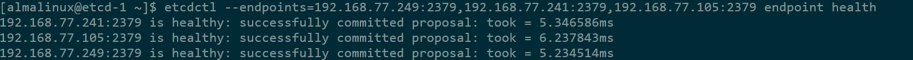
Целостность данных:
 ```
 etcdctl --endpoints=192.168.77.249:2379,192.168.77.241:2379,192.168.77.105:2379 endpoint hashkv --write-out=table
```

Узнал кто лидер:
```
etcdctl --endpoints=192.168.77.249:2379,192.168.77.241:2379,192.168.77.105:2379 endpoint status --write-out=table | grep "true" | awk '{print $2}'
```
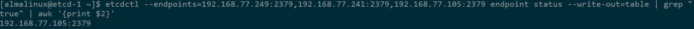
Отключение ведомого:
```
sudo systemctl stop etcd
```
Проверяем здоровье и целостность данных.
 ```
 etcdctl --endpoints=192.168.77.249:2379,192.168.77.241:2379,192.168.77.105:2379 endpoint health
 etcdctl --endpoints=192.168.77.249:2379,192.168.77.241:2379,192.168.77.105:2379 endpoint hashkv --write-out=table
```
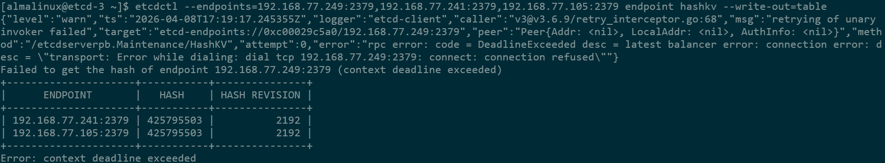
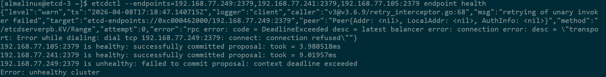
Включил etcd на ведомом обратно:
```
sudo systemctl start etcd
```
Снова проверил здоровье и целостность данных:
 ```
 etcdctl --endpoints=192.168.77.249:2379,192.168.77.241:2379,192.168.77.105:2379 endpoint health
 etcdctl --endpoints=192.168.77.249:2379,192.168.77.241:2379,192.168.77.105:2379 endpoint hashkv --write-out=table
```
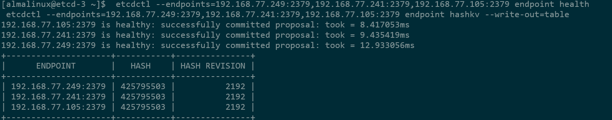
Отключил мастера:
```
sudo systemctl stop etcd
```
Опять проверил здоровье и целостность данных.
 ```
 etcdctl --endpoints=192.168.77.249:2379,192.168.77.241:2379,192.168.77.105:2379 endpoint health
 etcdctl --endpoints=192.168.77.249:2379,192.168.77.241:2379,192.168.77.105:2379 endpoint hashkv --write-out=table
```
и кто новый лидер:
```
etcdctl --endpoints=192.168.77.249:2379,192.168.77.241:2379,192.168.77.105:2379 endpoint status --write-out=table | grep "true" | awk '{print $2}'
```
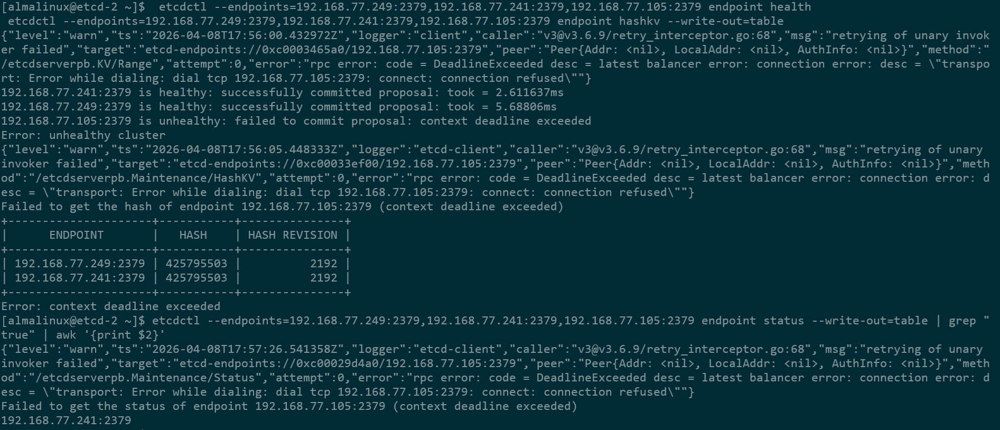
Данные консистентны, новый лидер выбран.
Включил бывший мастер обратно:
```
sudo systemctl start etcd
```
Проверил все то же самое:
здоровье:
 ```
 etcdctl --endpoints=192.168.77.249:2379,192.168.77.241:2379,192.168.77.105:2379 endpoint health
```
целостность данных:
 ```
 etcdctl --endpoints=192.168.77.249:2379,192.168.77.241:2379,192.168.77.105:2379 endpoint hashkv --write-out=table
```
и кто новый лидер:
```
etcdctl --endpoints=192.168.77.249:2379,192.168.77.241:2379,192.168.77.105:2379 endpoint status --write-out=table | grep "true" | awk '{print $2}'
```
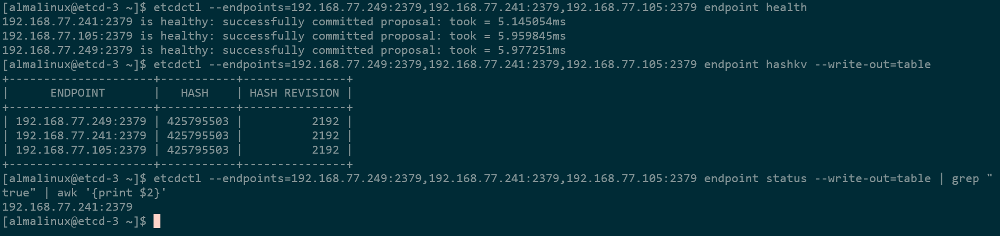
Данные консистентны, после включения "старого" лидера, он стал ведомым.  
Тестирование etcd успешно.

#### Тестирование patroni.
получил текущее состояние кластера:
```
patronictl -c /etc/patroni/patroni.yml list
```
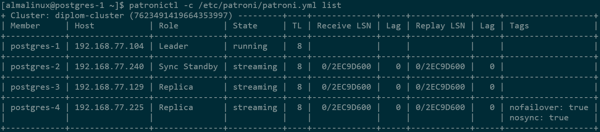
остановил сервис patroni на лидере:
```
systemctl stop patroni
```
Снова проверил текущее состояние кластера:
```
patronictl -c /etc/patroni/patroni.yml list
```
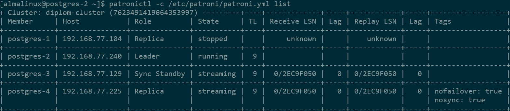
лидер поменялся.

Запустил сервис patroni на ноде, где останавливал:
```
systemctl start patroni
```
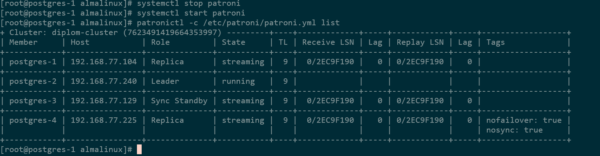
Бывший лидер стал репликой, новый лидер остался лидером.

Ручное переключение мастера.  
Переключил мастер обратно с postgres-2 на postgres-1:
```
patronictl -c /etc/patroni/patroni.yml failover --candidate postgres-1
```
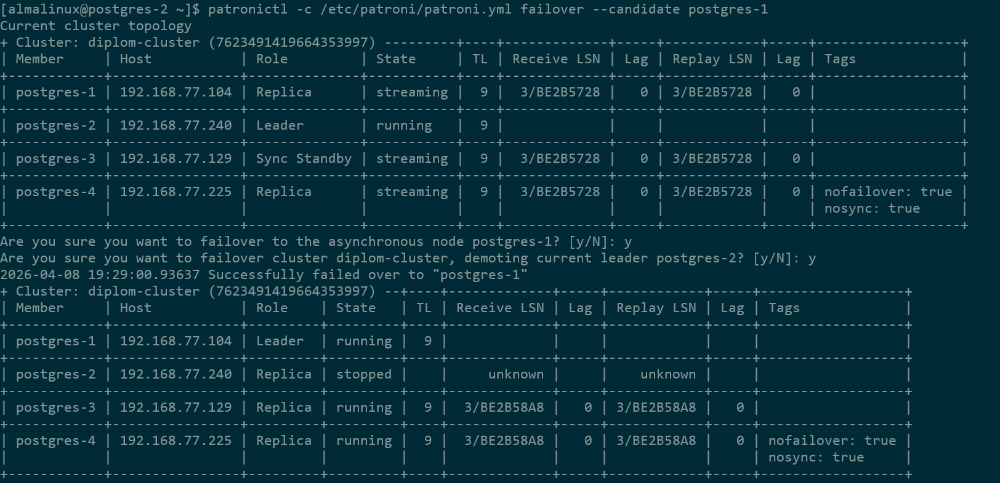
Мастер успешно переместился на postgres-1
Тестирование patroni успешно.
